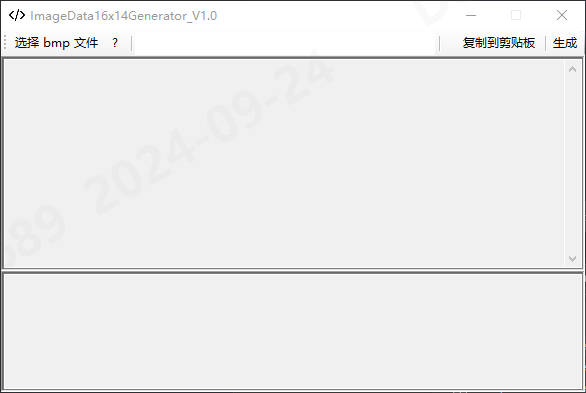

# README

## 简介

此软件主要用于将 16x14 像素比的 图片 转化为 十六进制 的字符串，主要用于 EtherCAT xml 文件中 ImageData16x14 一项的内容

该项目结构主要为:

+ .git: git 仓库
+ Demo: 用于测试的 bmp 图片文件
+ Image: README 显示的图片目录
+ ImageData16x14Generator: 项目工程目录
+ .gitignore: git 屏蔽文件说明
+ ImageData16x14Generator.sln: VS 工程文件
+ README.md 本文件

## 使用方式

打开软件后界面如下图所示:

